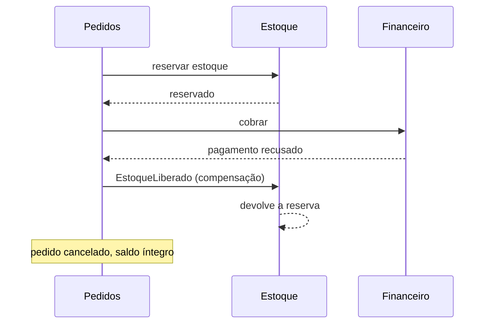

# Parte 1 — Arquitetura de microsserviços para o ERP

Sempre que possível, ligo a decisão ao código deste repositório. Arquitetura descrita no
abstrato é fácil de defender; a que já passou por implementação tem cicatriz, e as
cicatrizes estão marcadas ao longo do texto.

---

## 1. Divisão em serviços

Divido por **bounded context**, não por camada técnica. Serviço não é "o serviço de banco
de dados" nem "o serviço de API": é um pedaço do negócio que muda por um motivo próprio e
tem dono.

| Serviço | É dono de | Muda quando |
|---|---|---|
| **Produtos/Estoque** | catálogo, saldo, movimentação, alertas | regra de catálogo ou de reposição muda |
| **Pedidos** | o pedido e seu ciclo de vida | regra de venda muda |
| **Financeiro** | faturas, cobranças, crédito | regra fiscal ou de cobrança muda |
| **Clientes** | cadastro, documentos, segmentação | regra de cadastro muda |

Este repositório implementa o primeiro.

**Cada serviço é dono do seu banco** (database-per-service). É a parte que mais gera
discussão, então vale o argumento explícito: se o serviço de Pedidos puder dar `SELECT` na
tabela `produto`, ele passa a depender do *schema* do Estoque, e não da API dele. A partir
daí, renomear uma coluna quebra outro serviço, e a autonomia que justificava separar
desaparece. O que resta é um monolito distribuído: o custo da rede sem o benefício do
desacoplamento.

Pedidos **orquestra**, mas não é dono. Ele coordena estoque e financeiro sem mandar neles.

---

## 2. Comunicação: síncrona e assíncrona, cada uma no seu caso

Não é escolher um dos dois. É saber qual pergunta cada um responde.

### Síncrona (REST), quando o fluxo depende da resposta agora

Montar um contexto de venda precisa de cliente, crédito e prazo de entrega **antes** de
seguir. Esperar é o ponto.

Implementado em `GET /integracoes/contexto-de-venda/{cliente_id}`, com as três fontes indo
em paralelo. Medido na API real: cada fonte responde em ~49 ms e a resposta total sai em
50 ms, não 150.

O custo é acoplamento em tempo de execução: se o Financeiro cair, meu endpoint sente. Por
isso ele tem timeout por fonte, orçamento total e degradação — decisões e números no
[ADR 0009](adr/0009-consulta-paralela-degradacao.md).

E a regra que considero a mais importante de tudo isso: **falha nunca vira dado**. Se o
Financeiro está fora, a resposta traz `dados: null` e `status: "erro"`, jamais
`saldo_devedor: 0`. Um zero devolvido por engano faz o Pedidos concluir que o cliente está
limpo e liberar a venda.

### Assíncrona (eventos), quando pode acontecer depois

Pedido confirmado publica `PedidoConfirmado`. Financeiro gera a cobrança, Estoque dá baixa,
Clientes atualiza histórico — cada um no seu tempo, sem que Pedidos saiba quem escuta.

Duas vantagens que a síncrona não dá: resiliência, porque com um consumidor fora o evento
espera na fila em vez de o pedido falhar; e extensibilidade, porque adicionar um consumidor
novo (BI, antifraude) não toca no publicador.

Implementado em escala reduzida: `POST /produtos/{id}/estoque` responde `202` e enfileira,
o worker `arq` processa. É a mesma forma, com fila em vez de barramento de eventos
([ADR 0008](adr/0008-worker-de-estoque.md)).

### A regra prática que uso para decidir

Se o usuário está esperando na tela para saber se pode seguir, é síncrona. Se a operação
pode ser confirmada depois sem prejuízo, é assíncrona. E o teste decisivo: **se a operação
falhar em silêncio, alguém precisa ser acordado de madrugada?** Se sim, ela precisa de fila
com retry e persistência, não de uma chamada HTTP que se perde.

---

## 3. Consistência: Saga, e por que não transação distribuída

Com um banco por serviço, não existe `BEGIN` que cubra estoque e financeiro. Two-phase
commit resolveria no papel e trava recurso em todos os participantes enquanto o
coordenador decide — e um coordenador lento vira indisponibilidade em cascata.

A alternativa é **Saga**: a transação vira uma sequência de passos locais, cada um com uma
**compensação**.

Compensação não é rollback: é uma operação de negócio nova que desfaz o efeito da anterior.
Cancelar uma cobrança já emitida gera um estorno, não apaga a cobrança. Num ERP isso é
requisito contábil, não detalhe — o histórico tem que mostrar o que aconteceu, inclusive o
erro.

Isso implica **consistência eventual**: existe uma janela em que o estoque está reservado e
o pagamento ainda não confirmou. É preciso projetar para ela, e não fingir que não existe.
É o mesmo raciocínio que usei em duas decisões deste repositório: o TTL do cache existe
para o caso em que a invalidação não aconteceu ([ADR 0007](adr/0007-estrategia-de-cache.md)),
e a varredura periódica do worker existe para o caso em que o evento se perdeu
([ADR 0008](adr/0008-worker-de-estoque.md)). Em ambos, o mecanismo principal é o rápido, e
há uma rede de segurança lenta atrás.

**Idempotência é obrigatória**, e essa eu aprendi apanhando aqui. Fila entrega *pelo menos
uma vez*: configurei retry no worker antes de perceber que movimentar estoque não era
idempotente, e uma reentrega aplicaria a baixa duas vezes. A correção foi a tabela
`movimento_estoque` com chave única — e ela se provou em condição real, quando um job falhou
depois de commitar e o `arq` reentregou sem duplicar o efeito.

---

## 4. Persistência

### PostgreSQL como banco transacional de cada serviço

Dentro de um serviço, ACID de verdade. É o que garante que baixar estoque e registrar a
movimentação aconteçam juntos ou não aconteçam.

Uso o banco para o que ele faz melhor que código: `CheckConstraint` impedindo saldo
negativo, índice único parcial garantindo no máximo um alerta aberto por produto, e `UPDATE`
atômico em vez de ler-somar-gravar. Todas as três são garantias que continuam valendo para
quem escrever por fora do meu service — inclusive uma migration ou um script de correção.

O `UPDATE` atômico tem teste com cinco transações concorrentes: ler-somar-gravar deixaria o
saldo em 9 em vez de 5.

### Redis com três papéis

Normalmente se lembra só do primeiro:

1. **Cache** de leitura quente do catálogo, com invalidação por namespace versionado. Um
   `INCR` derruba todas as listagens em O(1), sem `SCAN` — que é O(n) sobre o keyspace — e
   sem `KEYS`, que bloqueia o Redis inteiro por ser single-threaded.
2. **Broker** do worker de background.
3. **Lock distribuído** para o *oversell*: dois pedidos disputando a última unidade em
   estoque.

**Sendo honesto sobre o terceiro:** ele não está implementado. O `UPDATE` atômico que uso
resolve perda de atualização, mas não substitui o lock quando a decisão de negócio depende
de *ler o saldo antes de decidir* — que é exatamente o caso da reserva de pedido. Está
registrado como limite explícito no ADR 0008, e pertence ao serviço de Pedidos.

Com mais tempo eu implementaria com Redlock, e com uma ressalva que acho importante: lock
distribuído com TTL não é garantia absoluta. Se o processo travar segurando o lock e o TTL
vencer, dois donos coexistem. Por isso a garantia final tem que estar no banco — no meu
caso, a `CheckConstraint` de saldo não negativo, que faz a transação falhar em vez de
gravar um número impossível.

---

## 5. API Gateway

Kong como porta única de entrada, resolvendo o que seria repetido em todo serviço:
roteamento, autenticação e validação de JWT, rate limiting, CORS, terminação TLS, e log e
tracing de borda.

O ganho não é técnico, é organizacional: sem gateway, cada time reimplementa autenticação, e
a quinta implementação vai ter um bug que as outras quatro não têm. Centralizar tira a
decisão de segurança de quem está com pressa para entregar uma feature.

Isso apareceu de forma concreta na Parte 5: o servidor MCP entra como **mais um consumidor
do gateway**, e não como serviço privilegiado com acesso direto ao banco. É o que faz o
agente de IA herdar exatamente as permissões do token que carrega, em vez de existir um
"usuário robô com acesso total" ([ADR 0010](adr/0010-servidor-mcp.md)).

O cuidado: gateway é ponto único de falha e tentação de virar lixeira de lógica de negócio.
Ele faz cross-cutting; regra de negócio fica no serviço.

---

## 6. Observabilidade

### Os três pilares

**Logs centralizados** (ELK ou Loki), estruturados em JSON e com `trace_id`. Log em texto
livre espalhado por dez serviços não responde nada.

**Métricas** (Prometheus + Grafana): latência por rota em percentis, taxa de erro,
saturação de pool de conexão, tamanho e idade da fila. Percentil, não média — a média
esconde exatamente o cliente que está sofrendo.

**Tracing distribuído** (OpenTelemetry + Jaeger), que é o mais importante em
microsserviços e o que não tem substituto no monolito. Ele responde a pergunta que aparece
toda semana: "o checkout está lento — onde?". Sem trace, isso vira três times olhando o
próprio gráfico e concluindo que o problema é do vizinho.

### O que eu monitoraria primeiro num ERP

Prioridade por **impacto financeiro e integridade**, não por volume de tráfego:

1. **Taxa de erro na criação de pedidos.** É receita não realizada, medida em tempo real.
2. **Falhas de cobrança e sagas incompletas.** Uma saga que parou no meio deixou estoque
   reservado sem pagamento. Esse é o alerta que eu colocaria para acordar alguém.
3. **Consistência de estoque.** Divergência entre saldo e a soma das movimentações é
   sintoma de bug ou de compensação que não rodou. O livro `movimento_estoque` deste
   projeto existe para essa conferência ser possível.
4. **Latência do checkout**, em p95 e p99.
5. **Idade da mensagem mais antiga na fila.** Fila crescendo é consumidor morto, e o
   sintoma aparece antes do prejuízo.

Um princípio que aplico ao alertar: alerta que não tem ação associada vira ruído, e ruído
treina o time a ignorar alerta. Prefiro poucos alertas que acordam alguém, e o resto em
painel.

---

## 7. AWS

Não fiz deploy, então descrevo o desenho e sou explícito sobre isso.

| Componente | Serviço | Por quê |
|---|---|---|
| Containers | ECS Fargate | sem gerenciar nó; EKS só se já houvesse Kubernetes na casa |
| Banco | RDS PostgreSQL Multi-AZ | failover automático; uma instância por serviço |
| Cache e fila | ElastiCache Redis | o mesmo Redis dos três papéis |
| Eventos | EventBridge ou SNS/SQS | SQS com *dead-letter queue*, que é onde a mensagem venenosa vai parar |
| Segredos | Secrets Manager | nunca `.env` em produção; a aplicação já lê tudo do ambiente |
| Imagens | ECR | com scan de vulnerabilidade no push |
| Observabilidade | CloudWatch + OTel Collector | exporta para o backend de tracing |

Dois pontos que costumam ficar de fora e eu colocaria desde o começo: **dead-letter queue**,
porque sem ela uma mensagem que sempre falha trava o consumo, e **auto scaling por
profundidade de fila**, e não só por CPU — worker de fila fica ocioso em CPU enquanto a fila
cresce, e escalar por CPU não reage.

---

## 8. O que a implementação me fez mudar de ideia

Vale registrar, porque é o que separa arquitetura defendida de arquitetura recitada.

**Camada de repository sobrevive à prova prática.** Eu poderia ter posto o SQL no service,
como faz uma referência conhecida da comunidade. Mantive a separação, e ela pagou: a política
de cache inteira e a regra de negócio de estoque são testadas sem Postgres no ar.

**Mas dublê tem um teto, e eu descobri onde.** O `ON CONFLICT` do alerta estava escrito de
um jeito que o Postgres recusa, e o dublê passava tranquilo — ele reimplementa o invariante
em Python, então validava a minha intenção em vez do meu SQL. Foi o que me levou a separar
testes de integração contra banco real dos testes rápidos. E a medir cobertura em vez de
confiar na contagem de testes: o SQL estava em 26%.

**Definição duplicada de um conceito de negócio diverge sozinha.** "Estoque baixo" existia
em dois lugares e as duas versões discordavam sobre produto inativo. Nenhuma revisão de
código pegou; um teste de integração pegou. Hoje há uma implementação só.
